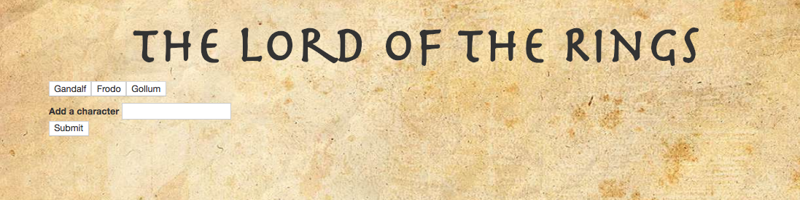
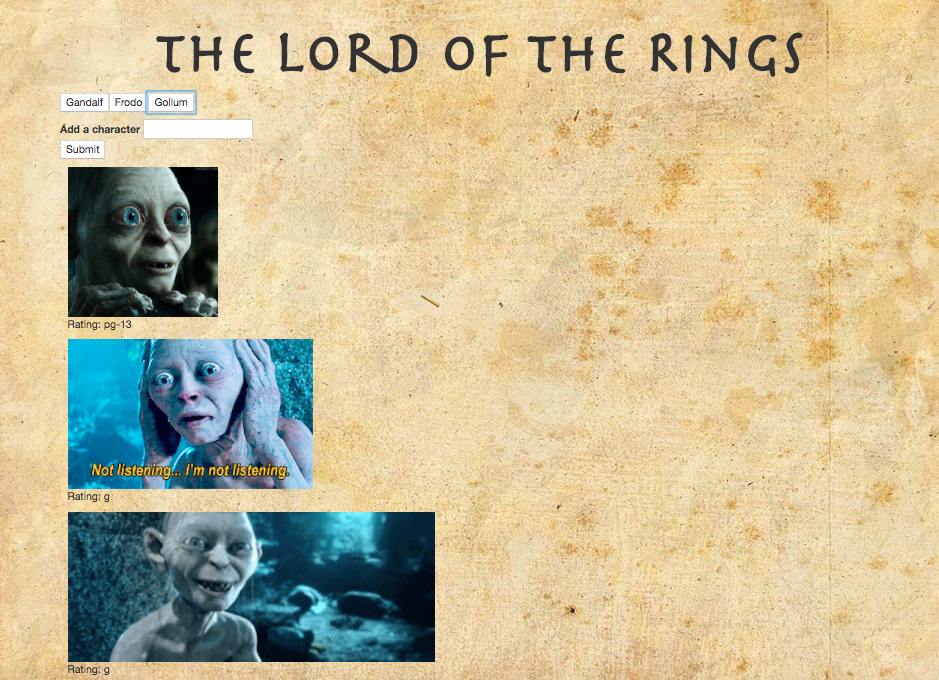
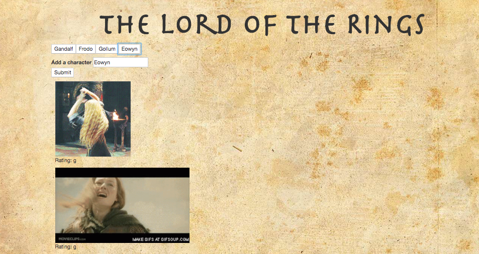

# GIPHY-API

## The Lord of the Rings

## Instructions
 
 This site pulls up animated GIPHYs from the Lord of the Rings.
 
 Here is how the page appears when it first loads:
 
 
 
It comes pre-populated with three characters: Gandalf, Frodo, and Gollum. When the user clicks on one of those character buttons, it brings up ten images of that character.

 

To add a character, the user types the character's name in the empty field and clicks "submit." A button appears with that character's name. Clicking on the new button brings up ten images of that character.

 

Clicking on any image starts the animation (there might be a slight delay), and clicking a second time stops the animation.
